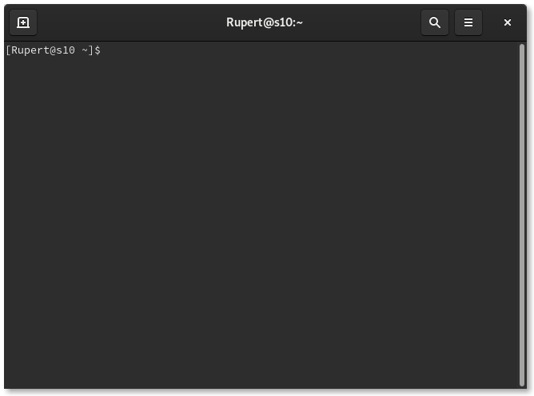
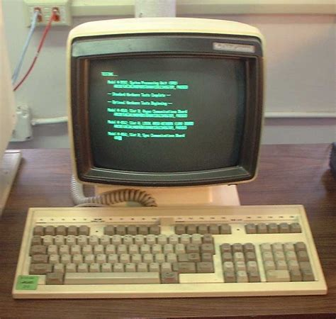

# 1 - Introdução ao Terminal

## Conceitos

### Terminal emulator (urxvt, st, kitty, alacritty, cmd, powershell…)

O emulador de terminal é um programa para exibir e receber texto. Nós como usuários o utilizamos para se comunicar com o computador. Apesar de comumente nos referirmos a ele como Terminal, é na verdade um emulador de terminal, um dispositivo eletrônico não mais utilizado (teletype ou TTY).

Tanto no windows existe o cmd e o powershell quanto no linux onde existe uma variedade de terminais diferentes. Para as distros Ubuntu padrão, o seu terminal será o GNOME Terminal: nele podemos escrever comandos e interagir com o computador de maneira direta. Para abrir seu terminal, existe um atalho: `CTRL + ALT + T`

Exemplo de um emulador de terminal:



Terminal antigo:



### Shell (bash, zsh, dash, fish…)

O shell é o programa que está sendo rodado por trás do emulador de terminal, sendo de suma importância para os terminais.

O shell é o responsável por entender o que você está escrevendo e interpretar nossos comandos. Cada shell tem uma linguagem própria para interpretar seus comandos, a shell por padrão instalada no sistema operacional unix é o bash, conhecendo essa linguagem mais a fundo é possível criar scripts e usar ela como uma linguagem de programação.

Sendo praticamente uma linguagem de programação existe o conceito de variáveis de ambiente, essas variáveis são importantes para guardar informações utilizadas pelo shell.

Para o shell entender os comandos que o usuário quer digitar é usado uma variável especial chamada PATH, essa variável define quais programas estão no escopo da shell, ou seja todos os programas na variável PATH podem ser executados independentemente de onde o usuário estiver.

(Mostrar um PATH de exemplo)

Nada mais que um programa que roda programas. (Aqui dá pra falar de variáveis de ambiente)

 (Explicar usuário comp local atual)

Em sua shell é provável que a tenha um texto como o da imagem acima, esse texto representa o nome do seu usuário e o nome de sua máquina separados por um @ e onde você se encontra atualmente.

Na imagem acima é possível ver que o usuário é o azz e o computador é o doom, atualmente o usuário se encontra em seu diretório HOME representada por uma variável `~`.

## Comandos

### echo

O comando echo é um simples programa que repete o argumento digitado pelo usuário.

Ex:
```bash
echo Olá mundo!
```

### ls (list)

O comando ls tem o objetivo de mostrar os arquivos de um diretório, caso não receba argumentos ele vai mostrar os arquivos do diretório atual.

Por ser um programa de linha de comando ele pode receber argumentos (Flags). Assim dando mais detalhes sobre os arquivos do diretório especificado.

Algumas flags importantes podem ser:
* `-l` ou `–-long`: Mostra a permissão do arquivo, tamanho do arquivo, última vez em que o arquivo foi modificado e o nome do arquivo em uma lista
* `-a`: No linux existem arquivos que não são exibidos normalmente chamados de dotfiles (Começam com um ponto, vamos abordar mais adiante), esses arquivos podem ser vistos usando a flag `-a`.

### cd (change directory)

O `cd` é um comando para mudar de diretório e navegar em seu computador, caso queira entrar/sair de um diretório.

### pwd (print working directory)

O `pwd` é um comando para mostrar seu diretório em que o usuário se encontra atualmente.

## Permissões

### Diretórios != Arquivos

### RWX (Read Write Execute)

Cada arquivo tem permissões de read write e execute, essas permissões são aplicadas para 3 tipos de usuários sendo os 3 tipos: dono do arquivo, alguém do mesmo grupo do dono do arquivo e outros usuários. Essas permissões podem ser vistas com o comando ls e a flag `-l`.

Na imagem acima o usuário aa dono do arquivo pode ler, escrever e executar o arquivo, usuários do mesmo grupo podem ler e executar enquanto outros usuários podem apenas ler o arquivo.

### Usuários e Grupos

### whoami

O comando whoami é um comando utilizado para mostrar o usuário atual.

### groups

O comando groups é o comando utilizado para mostrar os grupos que o usuário atual pertence.

### id

## Ajuda

### `–help` ou `-h`

Normalmente para cada comando existe uma flag -h ou a flag –help port extenso para mostrar como usar o programa.

### man

### tldr

O tldr provê uma pequena ajuda 

## Arquivos

### cat

### less/more

### head/tail

### strings

## Modificar

### mv

### cp

## Criar

### mkdir
### touch

## Editando

## Achar coisas
### find
### grep

## Responsáveis
* [Tsu](https://github.com/HTsuyoshi)
* [Emanuel]()
