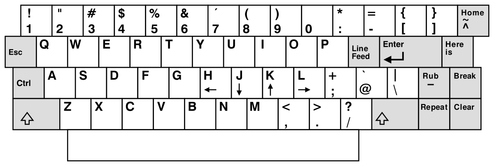

# vi , vim e Neovim

Vim é um editor de código fonte aberto antigo, muito popular entre programadores por ser altamente extensível e infame por sua dificuldade inicial de uso.
Entretanto, vim é uma versão melhorada (*vi* i*m*proved) do editor `vi`, que não continha _syntax highlighting_, modo visual, scripting e outras gostosuras.
Billy Joy programou o vi nos anos 70,  com base em no editor `ex` e tem seu nome por ser o modo `*vi*sual` deste. O vi surgiu em uma época onde se acessava computadores 
através de terminais remotos, cujo layout dos teclados era levemente diferente: As setas direcionais eram acessadas pelas teclas `hjkl` e a tecla Escape 
econtrava-se onde encontramos a Caps Lock.



Vim foi criado e mantido por Bram Moolenaar, porém o fato de ser ainda o único *maintainer* do repositório, as atualizações do editor não conseguem acompanhar 
as vontades da comunidade e devido a isso, criou-se o editor Neovim, que é um *fork* do editor vim, visando refatorar o editor e adicionar novas funcionalidades 
de maneira mais rápida, mas ainda mantendo compatibilidade com o seu predecessor. Neovim tem suporte nativo a Language Server Protocols, adota Lua como sua linguagem principal para
scripts [ETC ETC PREENCHER]

# Por quê VIM?
Para os acostumados com a sintaxe e o jeito de funcionar do vim, editar um arquivo se torna uma torna muito menos monótona e muito mais dinâmica: 
Ações complexas requerem poucas teclas digitadas para serem computadas e tarefas repetitivas podem ser facilmente repetidas com uma ou duas teclas (`.` ou `@`).
Adicionalmente, devido a sua origem, o editor força o usuário a nunca tirar a mão de perto das letras, e isso permite que ações sejam encadeadas sem interrupções. 
Além disso, vim permite que funções novas de edição sejam criadas, dando liberdade ao usuário de customizar, através do arquivo .vimrc.

# Os básicos.

## Como abrir um arquivo:
Para abrir um arquivo com vim, basta digitarmos no terminal: `vim [nome-do-arquivo]`. Caso o arquivo não exista, o editor tratará de criar esse arquivo para você.

## Ué, porque o que eu escrevo não aparece na tela?

Se você acabou de abrir o editor e já tentou escrever alguma coisa, vai perceber que o resultado não foi nada esperado. 
Isso se dá porque vim funciona através de modos: Quando abrimos o editor, ele está no modo normal, que permite a navegação pelo texto, mas não a edição.
Para editarmos, basta digitar `i` dentro do modo normal, o que nos levará ao modo de inserção, nele podemos digitar sem obstáculos. 
Para sairmos do modo de inserção, basta apertar a tecla Esc que voltaremos ao modo normal. Essa lógica vale para todos os modos que você se encontrar.

## Ok, mas como que eu salvo um arquivo?
Você não sai. MUAHAHAHAHAHAH. Brincadeira. Para salvarmos um arquivo, precisamos dizer ao editor que vamos executar um comando.
Para isso, precisamos estar no modo normal e então digitar `:w` e apertar a tecl Enter. Os dois pontos ativam o modo de linha de comando, 
já o caractere `w` indica o comando de salvar o conteúdo escrito na tela para o arquivo. 

A partir de agora é só colinha para refrescar os comandos:

# Modo Normal
## Movimentação

-  Toda movimentação pode receber uma quantidade antes que indica quantas vezes será repetida. Ex: `4j` ou `50l`
-  Por caracteres: `h`(esquerda), `j`(baixo), `k`(cima), `l`(direita)
-  Por "palavra": `w`(começo da próxima palavra, `e`(final da próxima palavra), `b` (começo da palavra anterior)
-  Por linha (não aceita quantidade): `0`(começo da linha), `$`(final da linha)
-  Por arquivo: `gg`(Começo do arquivo), `G`(Final do arquivo) 

## Desfazer ações
-  Desfazer: `u`
-  Desfazer o desfazer: `R`

## Deletar
-  Aceita quantidades antes da ação
-  Deletar por movimento: `d` + movimento
-  Deletar linha inteira: `dd`
-  Deletar até o final da linha: `D`

## Copiar e Colar
-  Copiar por movimento: `y` + movimento
-  Copiar linha inteira: `Y` ou `yy`
-  Colar antes do cursor: `P`
-  Colar depois do cursor: `p`

# Modo de Inserção (entra-se a partir do modo normal)
-  Inserir antes do cursor: `i`
-  Adicionar ao final do cursor: `a` 
-  Sair do modo normal : Tecla Esc

# Modo visual (entra-se a partir do modo normal)
-  Funcionalidade igual ao modo normal, porém selecionando texto.
-  Ativar modo visual por caractere: `v`
-  Ativar modo visual por linha: `V`
-  Ativar modo visual por coluna: `CTRL+V`


# Modo de comandos (entra-se a partir do modo normal ou visual)
-  Ativar modo:  `:`
-  Procurar e substituir uma vez na linha: `s/PADRAO-DE-PROCURA/TEXTO-DE-SUBSTITUICAO/` + tecla ENTER
-  Procurar e substituir todas as ocorrências na linha: `s/PADRAO-DE-PROCURA/TEXTO-DE-SUBSTITUICAO/g` + tecla ENTER
-  Procurar e substituir confirmando a substituição: `s/PADRAO-DE-PROCURA/TEXTO-DE-SUBSTITUICAO/c` + tecla ENTER

# BIBLIOGRAFIA e extras
Caso queira se aprofundar no editor, o livro 'Learning the vi and Vim editors', 
de Arnold Robbins, Elbert Hannah e Linda Lamb (O'Reilly, 7a ed.) é uma ótima escolha.

Recomendo também o uso do vimtutor, que é um arquivo de texto ensinando a usar o vim, aberto dentro do próprio editor.
Para utilizar o vimtutor, basta digitar no seu terminal:
```sh
vimtutor
```
