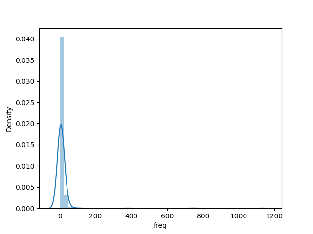

# 4 - Manipulação De Dados

## Introdução

Com a quantidade de dados disponíveis na internet e até mesmo nos arquivos de um computador (como logs de acesso), é inevitável que em algum momento um programador se depare com problemas em que é necessário realizar alguma manipulação ou tratamento dos dados que encontrou. Esses dados podem estar em diferentes formatos, sejam imagens, arquivos de áudio ou apenas texto em um uma estrutura que não necessariamente é familiar à quem está acessando o arquivo.

Nesta aula focaremos em manipulação de texto, dado que é algo mais comum de se encontrar e mais simples de se assimilar para o público geral. Basicamente, o que queremos nesta aula é manipular dados com dois propósitos diferentes, mas extremamente úteis: extração de informação pelos dados de um arquivo, e a extração de dados através de requisições na web. 

## Tópicos
Aqui estão alguns tópicos importantes que serão falados nessa aula: 5 comandos interessantes para manipulação de dados e um pouco sobre a ideia de APIs e regex.

- grep
- sed
- regex
- awk
- APIs
- jq
- curl

## Manipulações básicas e padrões de texto com `grep`

Imagine que você tem um texto (ou arquivo de texto) e queira lê-lo pelo terminal. Você pode fazer isso com o comando cat (ou várias outras maneiras) caso tenha um arquivo de texto:

```
$ cat accesslog.txt
```

Você também pode escrever no terminal usando `echo` e salvar em um arquivo o texto:

```
$ echo "Semestre Perdido" > textinho.txt
$ cat textinho.txt
Semestre Perdido
```

Vamos voltar ao arquivo `accesslog.txt` e vermos o que tem nas primeiras linhas

```
$ head -n 3 accesslog.txt
143.95.66.197 - - 19/May/2021:05:13:33 "POST /wp-cron.php?doing_wp_cron=1621415613.4137198925018310546875 HTTP/1.1" 200 - "http://www.example.com/wp-cron.php?doing_wp_cron=1621415613.4137198925018310546875" "WordPress/5.7.2; http://www.example.com"
63.143.42.247 - - 19/May/2021:05:13:33 "HEAD / HTTP/1.1" 301 - "http://example.com" "Mozilla/5.0+(compatible; UptimeRobot/2.0; http://www.uptimerobot.com/)"
63.143.42.247 - - 19/May/2021:05:13:33 "HEAD / HTTP/1.1" 200 - "http://example.com" "Mozilla/5.0+(compatible; UptimeRobot/2.0; http://www.uptimerobot.com/)"
```

É bem provável que você não tenha entendido nada deste arquivo. Basicamente ele é um exemplo de log de acesso à um webservice em wordpress, então cada linha é uma requisição vinda de um IP, e então podem ser detectadas informações como a data e hora da requisição, o tipo de requisição HTTP (como POST, GET e HEAD, voltaremos a isso quando falarmos mais de APIs), o código de status HTTP etc.

Ainda assim, é um amontoado de dados, e quando manipulamos dados é justamente para conseguir capturar de uma forma mais "legível" o que os dados de uma fonte querem dizer, ou seja, trazer alguma informação deles.

Para poder extrair informações é útil identificar se a sua fonte de dados (como este log) segue alguma estrutura identificável por um humano, e neste caso sim, pois cada linha tem um esquema padrão de formar o conteúdo: IP, separadores, data da requisição, url requisitada com seu método HTTP, status, tamanho do objeto de retorno quando aplicável, url de retorno e user-agent.

Temos um padrão, então vejamos algumas informações que podemos extrair com isto! Por exemplo, quantas requisições que foram um sucesso existem? Isso quer dizer que queremos todas as requisições que tiveram um status code 200. Podemos perceber o que status code vem como um padrão do tipo: `espaço`+`número`+`espaço`. Façamos isso então com o comando `grep`:

```
$ cat accesslog.txt | grep " 200 " | wc -l
3949
```

O `grep` retorna todas as vezes que o padrão `" 200 "` foi encontrado no log. Caso nunca tenha visto antes, o comando `wc` conta a quantidade linhas, palavras e bytes de um arquivo, e o parâmetro `-l` diz que queremos retornar apenas a quantidade de linhas.

O `grep` é um comando simples mas bem útil para alguns casos. Ele retorna destacando todas as vezes que uma palavra foi identificada, junto ao texto original. Você pode utilizar seus parâmetros para usar coisas como expressões regulares (`-e`), ou especificar como vai ser a saída do comando (`-o` para retornar apenas a parte que coincide com o padrão). 

Você sempre pode verificar isto pelo manual com `man grep` ou a versão resumida em `grep --help`. O comando mostrado acima é a mesma coisa que usar, por exemplo, `cat accesslog.txt | grep -c " 200 "`, pois o parâmetro `-c` significa que está retornando apenas a quantidade de linhas em que houve o match.

`grep` não precisa ser usado apenas com textos, ele pode ser usado para realizar filtros nas suas pesquisas junto à outros comandos. Por exemplo, é possível retornar todas as ocorrências de arquivos em uma pasta que tenham uma extensão específica:

```
$ ls | grep ".txt"
accesslog.txt
evidencias.txt
textinho.txt
```

Caso tenha curiosidade, você poderia verificar quantas linhas existem no total no arquivo de logs com 
`cat accesslog.txt | wc -l` e verificaria que existem 5874 acessos, e como 3949/5874 = 0.67, temos com uma análise inicial que 33% dos acessos tiveram algum problema de retorno da requisição.  

Adiantando um pouco de expressões regulares, você pode com o próprio `grep` usá-las para identificar padrões de texto. Um exemplo didático seria contar a quantidade de palavras no refrão de evidências, note que este (assim como muitos exemplos a seguir) podem não parecer muito úteis ~~e realmente não são~~ mas são interessantes para trazer um conhecimento melhor do arsenal que você tem para utilizar quando manipula dados. Este caso específico poderia ser alterado para, por exemplo, realizar uma análise de frequência dos caracteres em senhas de acesso, por exemplo.

```
$ cat evidencias.txt | grep -o -e "[aeiou]" | wc -l
66
```

Agora você pode dormir tranquilamente sabendo que existem 66 vogais no refrão de Evidências.

## `Sed` e expressões regulares

O trabalho do `grep` foi muito útil para identificar padrões e extraí-los, mas e se nosso intuíto fosse modificar os textos a fim de gerar novos arquivos ou mesmo reduzir a quantidade de dados e gerar mais informação? Neste caso a ferramenta que tenderá a ter mais utilidade que o `grep` é o `sed`.

O comando `sed` (Editor de Streams/Fluxo)funciona como um editor de texto para o Linux, sendo utilizado essencialmente para filtragem de texto. Isso quer dizer que ele é uma ótima ferramenta para limpar textos e, consequentemente, sumarizar dados para trazer mais informação.

A sintaxe do sed segue uma formatação do tipo:

```
sed <parâmetros> <string de "filtro"> <arquivo fonte>
```

Essa string de filtro é o padrão do `sed` para realizar as expressões de filtro, essencialmente ela segue o formato `"<operação a ser realizada>/<expressão para filtro>/<substituição>/<operador adicional>"`

Por exemplo, imagine que por algum motivo faça sentido remover todas as vogais de um arquivo de texto. Você pode criar uma nova saída que obedeça esse requisito desta  maneira:

```
$ echo "Thanks for the memories" > memories.txt
$ sed 's/[aeiou]//g' memories.txt
Thnks fr th mmrs
```

O `sed` precisou de 4 informações para gerar este filtro:
- `s/`: Dizendo que queremos fazer uma substituição
- `[aeiou]/`: Vem de expressões regulares, e siginifica que qualquer elemento que esteja neste conjunto será substituido (entrará no filtro).
- `/`: Como não substituiremos por nada, basta apenas declarar a barra. Caso fosse necessário substituir os elementos filtrados por [aeiou] por outro termo, poderiamos usar uma sintaxe do tipo `TERMO/`
- `g`: Esse operador indica que faremos a substituição para todas as vezes que seja identificada uma vogal, para todas as linhas.

Veja o que aconteceria se não fosse declarado o `g`:

```
$ sed 's/[aeiou]//' memories.txt
Thnks for the memories
```

Você pode notar que ele substitui apenas a primeira vogal, pois quando um filtro é obedecido pelo `sed` (nesta estrutura sem `g`) ele irá para a próxima linha identificar o mesmo padrão novamente.

A substituição de caracteres pode ser aplicada também para reduzir elementos semelhantes à um único, de igual valor. Um exemplo é reduzir todas as letras "a" com acento de um texto para uma única letra "a".

```
$ sed 's/[ÃÀÁãàá]/a/g' evidencias.txt
E nessa loucura de dizer que nao te quero
Vou negando as aparências
Disfarçando as evidências
Mas pra que viver fingindo
Se eu nao posso enganar meu coraçao
Eu sei que te amo
```

Mas `sed` pode ser extremamente mais útil se explorarmos mais o campo de expressões regulares(assim como o `grep` e o `awk` que será visto posteriormente). 

Expressões Regulares (ou RegEx) é uma maneira de se extrair padrões textuais de maneira sucinta, ainda que estranha à primeira vista. O RegEx consiste de alguns caracteres padrão que representam, por exemplo, que um padrão termina com tal caractere, ou consiste de uma sequência finita de caracteres de um conjunto pré determinado. Os principais caracteres especiais usados em expressões regulares estão na seção [Pontos importantes de regex](#pontos-importantes-de-regex)

Podemos por meio de RegEx, por exemplo, pegar todos as datas que estão no nosso arquivo de log de acesso. Nele é possível identificar que o formato de uma data segue um padrão, veja algumas datas:

- 19/May/2021:05:23:33
- 19/May/2021:18:16:36
- 10/Mar/2019:19:10:06

Percebeu o padrão? Ele é
- DD/Mês/YYYY:HH:mm:ss

Então podemos modelar essa estrutura com regex! Boa parte do trabalho com expressões regulares é identificar como uma estrutura pode ser representada como expressão regular, quando pode. Por isso existem muitas implementações de expressões regulares na web para casos clássicos como para captura de email e data, em diferentes linguagens de programação. Aqui faremos do zero:

Nossa expressão regular precisa dos seguintes elementos, nesta ordem:

- `[0-3][0-9]`: Cada dia é um número representado por dois caracteres: O primeiro vai de 0 à 3 e o segundo de 0 à 9;
- `/`;
- `[A-Z][a-z]{2}`: Três caracteres agora, o primeiro em maiúscula e os dois seguintes (extados dois) em letra minuscula;
- `/`;
- `[0-9]{4}`: Extamante quatro dígitos para representar o ano;
- `:`;
- `[0-2][0-9]`: Dois dígitos para representar a hora;
- `:`;
- `[0-6][0-9]`: Dois dígitos para representar os minutos;
- `:`;
- `[0-6][0-9]`: Dois dígitos para representar os segundos;

Então, se colocarmos tudo junto (e na sequência), temos a pequena e belíssima linha que representa o padrão de data para este log:

`[0-3][0-9]/[A-Z][a-z]{2}/[0-9]{4}:[0-2][0-9]:[0-6][0-9]:[0-6][0-9]`

**Observação**: [0-9] é o equivalente à [0123456789], assim como [A-Z] é [ABC...XYZ], ou [A-Za-z] é [ABC..XYZabc...xyz] e assim por diante.

Então, o que podemos fazer com essa expressão regular que penamos para desenvolvê-la? Comecemos com o `grep` para verificar quantas instâncias de data no formato dia/mês/ano diferentes temos:

```
cat accesslog.txt | grep -oE '[0-3][0-9]/[A-Z][a-z]{2}/[0-9]{4}' | sort | uniq -c | sort -nk1,1 | tail

4 05/Feb/2018
4 10/Mar/2019
4 22/Mar/2019
4 25/Mar/2019
6 13/Feb/2018
6 24/Feb/2018
8 24/Mar/2019
11 08/Mar/2019
15 07/Mar/2019
5780 19/May/2021
```

Podemos notar então que há um total desbalanceio de dados em questão à quantidade de logs que existem para uma data (19/May/2021) comparada às outras, usemos então apenas estes dados para nossas análises, para deixar os resultados mais coerentes com o panorama geral possível de ser generalizado.

```
cp accesslog.txt full_log.txt
sed -i '/19\/May\/2021/!d' accesslog.txt
```

O parâmetro `-i` é usado para determinar que o que há no arquivo será sobrescrito. Lembra que o caractere "/" era usado na string do sed para separar entre a função de cada parte do filtro? Pois bem, como nossa expressão de match também têm a barra para separar as datas é necessário usar a contrabarra também ("\/"), sendo também muito comum em expressões regulares no geral. `d` é usado para dizer que serão excluídas as linhas que seguem um padrão, e `!d` significa que excluíremos todas que não seguem o padrão de match.

### Extraindo valor dos dados

E se nosso objetivo com estes logs fosse identificar as mensagens que tiveram sucesso? Isso pode ser identificado pelo status code HTTP = 200.

```
$ sed -E -i 's/" 200 (-|[0-9]+) "/ SUCESSO /' accesslog.txt
$ sed -E -i 's:" [0-9]{3} (-|[0-9]+) ": FALHA :' accesslog.txt
$ cat accesslog.txt | grep -E -c "SUCESSO|FALHA"
5780
$ cat accesslog.txt | grep -E -c "SUCESSO"
3937
$ cat accesslog.txt | grep -E -c "FALHA"
1843
```

Com isso é possível perceber que aproximadamente 32 % das requisições falharam.

Todas as linhas tiveram seu código substiuído por SUCESSO ou FALHA, o que pode ser útil para sumarizar análises do motivo de estarem sendo geradas tantas falhas.

E se quissésemos, agora com as requisições que falharam, identificar quais foram os IPs de Origem? Mais ainda, quantas vezes um mesmo IP fez requisições e falhou! Para isso é necessário capturar por meio de expressões regulares o IP, e você pode fazer isso de uma maneira como essa:

```
"^[0-9]{1,3}.[0-9]{1,3}.[0-9]{1,3}.[0-9]{1,3}"
```

Então, usando essa expressão regular podemos capturar os IPs e verificar a quantidade de requisições 
feitas:

```
# REQUISIÇÕES FALHAS
$ sed '/ SUCESSO / d' accesslog.txt | grep -oE "^[0-9]{1,3}.[0-9]{1,3}.[0-9]{1,3}.[0-9]{1,3}" | sort | uniq -c | sort -nk1,1 | tail
16 69.163.225.121
16 75.119.215.210
18 208.97.176.50
22 78.129.165.8
22 80.251.219.111
24 51.79.160.231
26 193.106.30.100
32 173.236.176.16
32 174.138.34.118
370 63.143.42.247
```

```
# REQUISIÇÕES SUCESSO
$ sed '/ FALHA / d' accesslog.txt | grep -oE "^[0-9]{1,3}.[0-9]{1,3}.[0-9]{1,3}.[0-9]{1,3}" | sort | uniq -c | sort -nk1,1 | tail24 173.236.176.16
24 178.175.132.66
24 51.79.160.231
28 174.138.34.118
36 154.16.241.114
66 54.202.223.6
82 78.129.165.8
370 63.143.42.247
370 69.162.124.230
1121 143.95.66.197
```

Você pode passar os arquivos gerados para outras linguagens de programação mais poderosas para análise de dados como Python e R. Veja um exemplo com python onde capturamos todos os IPs e vemos a distribuição de probabilidade correspondente ao número de requisições feitas em um dia:

```
$ cat accesslog.txt | grep -oE "^[0-9]{1,3}.[0-9]{1,3}.[0-9]{1,3}.[0-9]{1,3}" | sort | uniq -c > IPs.txt
$ python3 plot.py IPs.txt
```


Os familiarizados com gnuplot também podem utilizá-lo, assim como outras ferramentas que acharem pertinentes.

Para os interessados, segue o código do gráfico:
```
$ cat plot.py
import matplotlib.pyplot as plt
import seaborn as sns
import sys
import pandas as pd

if __name__ == "__main__":
	data = pd.read_csv("./{}".format(sys.argv[1]), delimiter="\s", header=None, names=["freq", "ip"])
	sns.distplot(data.freq)
	plt.show()
```

## Pontos importantes de regex

- wildcard (.)
- startswith, endswith (^ e $)
- groups e sets (() e \[\])
- ou (|)

- **\***: Nenhuma ou mais vezes
- **+**: Uma ou mais vezes
- **?**: Zero ou uma vez
- **{n}**: n vezes
- **{n, m}**: De n a m vezes

## `awk`

`awk` é outro editor / manipulador de texto (e também uma linguagem de programação). Esse comando pode fazer tudo que o `cat`, `sed` e o `grep` fazem, desde que se siga sua sintaxe. Vamos apenas mostrar alguns resultados que podem ser tirados usando o `awk`

Para começar, você pode exibir todas as linhas de seu arquivo usando `awk` tal como com `cat`, assim:

```
$ awk '{print}' IPs.txt
```

E assim vão ser "printados" toda a contagem de IPs que fizeram requisições - tudo que existe neste arquivo.

Neste arquivo existem duas colunas: a primeira é a contagem e a segunda são os IPS, você pode imprimir apenas a segunda coluna por exemplo:

```
$ awk '{print $2}' IPs.txt
```

Mas `awk` é muito poderos mesmo, você pode facilmente interagir com seus arquivos ou sistema operacional da maneira que quiser (e que conseguir implementar)! Vamos usar o comando `ls -la`  com o `awk` e filtrar a hora em que cada arquivo da pasta corrente foi alterado:

```
$ ls -la | awk '{print $8, "-----",  $9}'
15:15 ----- .
15:19 ----- ..
14:24 ----- accesslog.txt
17:01 ----- evidencias.txt
14:21 ----- full_log.txt
14:54 ----- ips.png
14:50 ----- IPs.txt
17:00 ----- memories.txt
02:52 ----- plot.py
15:22 ----- README.md
```

Você também pode sgerar estatísticas usando por exemplo R (que é outra linguagem de programação) podendo fazer tudo direto como entrada pelo terminal:

```
awk '{print $1}' IPs.txt | R --no-echo -e 'x <- scan(file="stdin", quiet=TRUE); summary(x)'

Min. 1st Qu.  Median    Mean 3rd Qu.    Max. 
   1.00    2.00    4.00   11.92    8.00 1123.00
```
Acima está um pequeno código em R para gerar as estatísticas de frequência de envios de requisições de cada IP.

Gerar apenas linhas que tenham um certo padrão de caracteres como o `grep` é possível usando o match do `awk` também:

```
$ ls -la | awk 'match($NF, /txt/) {print $1,$9}'
-rw-rw-r-- accesslog.txt
-rw-rw-r-- evidencias.txt
-rw-rw-r-- full_log.txt
-rw-rw-r-- IPs.txt
-rw-rw-r-- memories.txt
```

Outro exemplo de uso é imprimir o texto com um indicador de linhas:

```
$ awk '{print NR, $0}' ploJSONt.py
1 import matplotlib.pyplot as plt
2 import seaborn as sns
3 import sys
4 import pandas as pd
5 
6 if __name__ == "__main__":
7 	data = pd.read_csv("./{}".format(sys.argv[1]), delimiter="\s", header=None, names=["freq", "ip"])
8 	sns.distplot(data.freq)
9 	plt.show()
10 
```

Viu a quantidade de possibilidades? Tudo isso e mais é possível ao conhecer mais profundamente e obtendo experiência ao usar o `awk`. Lembre-se que ele também é uma linguagem de programação, então você pode usar loops, condicionais e outras estruturas básicas de qualquer linguagem de programação. Não ensinaremos uma linguagem de programação como o `awk` para o escopo deste curso, mas é importante que você conheça sua estrutura básica e possibilidades caso queira se aventurar em algo mais profundo de processamento de texto pelo terminal. Um exemplo de formatação de saídas com `awk` usando estruturas BEGIN-END é visto neste último exemplo.

```
ls -la | awk 'BEGIN {print "INICIO DA LISTA"} /txt/ {print $NF} END {print "FIM DA LISTA"}'
INICIO DA LISTA
accesslog.txt
evidencias.txt
full_log.txt
IPs.txt
memories.txt
FIM DA LISTA
```

## Sobre APIs

API (Interface de programação de aplicações) é uma maneira muito utilizada atualmente por programadores e pessoas que extraem dados de maneira geral na web. Uma API pode ser imaginada como um sistema, mais especificamente uma interface, desenvolvida para permitir que pessoas que tenham acesso à API de capturar dados ou utilizar os serviços disponibilizados.

Um exemplo de API é a do Twitter, que permite capturar (obviamente) tweets da plataforma de maneira automatizada, desde que quem consuma a API utilize suas credenciais e tome cuidado com a quantidade excessiva de requisições que faz no website. A API do whatsapp permite pagamentos utilizando a plataforma como pagamento, e também facilitar a relação entre consumidor e empresa.

Quando estamos desenvolvendo algo, é comum que em algum momento precisemos de dados, mas esses dados podem ser de outra empresa e, dependendo do interesse dela em disponibilizar os dados, ela pode criar uma API que seja acessível à comunidade (pagando ou não).

As informações retornadas pela API quando se faz uma requisição tipicamente seguem um formato/extensão `.xml` ou `.json`. Vejamos como realizar este processo usando [json](#consumindo-apis-com-curl-e-lendo-com-jq)

Também, em requisições web é comum encontrar códigos de status HTTP e alguns métodos específicos de requisições feitas para uma API, em especial: 
- GET: captura dados requisitados;
- DELETE: remove um recurso;
- POST: Envia algo ao servidor (como um formulário ao clicar no botão enviar);
- PUT: Insere/substitui informações em um campo;
- HEAD: Faz o mesmo que o GET, mas retorna apenas o cabeçalho da requisição.

Focaremos no `GET` pois não vamos interagir com nenhum servidor, apenas capturar dados para uma possível manipulação.

## Consumindo APIs com `curl` e lendo com `jq`
cURL (client URL) tem várias utilidades para manipulação de dados, em especial para fazer requisições à uma API.

Usaremos a API viacep para os exemplos. Isso se deve por ela não necessitar de uma chave para fazer as requisições. Essa API serve para pegar dados, e não inserir, e os dados capturados são endereços via cep ou alguma outra especificação que façamos na url. Cada API tem suas peculariedades, por isso é necessário verificar sua documentação, mas ainda que tenha diferença na formatação, é padrão que a url contenha as informações dos dados que você quer acessar, e com elas o serviço web que fornece a API disponibilizará as informações corretas.

No exemplo a seguir passamos o CEP 03828-000 no formato de url que a API aceita, queremos fazer uma requisição GET (pegar dados do serviço) e poderíamos salvá-los ou uilizar eles da maneira que fosse conveniente.

```
$ curl --request GET 'viacep.com.br/ws/03828000/json/'
{
  "cep": "03828-000",
  "logradouro": "Rua Arlindo Bettio",
  "complemento": "",
  "bairro": "Vila Guaraciaba",
  "localidade": "São Paulo",
  "uf": "SP",
  "ibge": "3550308",
  "gia": "1004",
  "ddd": "11",
  "siafi": "7107"
}
```

**Observação:** Essa API permite que as informações sejam retornadas em XML ou json. APIs REST seguem que você faça a requisição pela url, não falaremos de APIs SOAP, mas elas consistem de fazer as requisições em um estilo xml.

APIs tendem a manter uma versatilidade quando são disponibilizadas, isso quer dizer que não necessariamente há apenas uma maneira de se fazer uma requisição. Nessa API, por exemplo, é possível buscar as outras informações por meio de UF, cidade e logradouro:

```
$ curl --request GET 'viacep.com.br/ws/SP/São Paulo/Rua da Reitoria/json/'
[
  {
    "cep": "05508-220",
    "logradouro": "Rua da Reitoria",
    "complemento": "",
    "bairro": "Butantã",
    "localidade": "São Paulo",
    "uf": "SP",
    "ibge": "3550308",
    "gia": "1004",
    "ddd": "11",
    "siafi": "7107"
  }
]
```

O formato de saída dessa API é json, que é extremamente comum de se encontrar em APIs. Você poderia usar expressõres regulares para capturar, por exemplo, o logradouro, mas não é porque você poderia que você deveria. Muitas das transformações clássicas de dados já foram implementadas por outros comandos (ou pacotes/bibliotecas de outras linguagens de programação). 

Para ler arquivos `json` pelo terminal é possível usar o comando `jq`. Esse comando é muito simples e pode ser usado com o `curl`, como no exemplo a seguir:

```
$ curl --location --request GET 'viacep.com.br/ws/03828000/json/' | jq '.logradouro'
  % Total    % Received % Xferd  Average Speed   Time    Time     Time  Current
                                 Dload  Upload   Total   Spent    Left  Speed
100   230    0   230    0     0    328      0 --:--:-- --:--:-- --:--:--   328 --:--:-- --:--:--   328
"Rua Arlindo Bettio"
```

É retornada algumas informações adicionais, mas o essencial está na última linha: o logradouro pode ser facilmente retornado após se fazer a chamada à API com o `curl`.

Outra coisa comum em arquivos json é quando há mais de um conjunto de dados que obedece a requisição. o comum neste caso é retornar tudo que obedece a requisição, como no exemplo:

```
$ curl --request GET 'viacep.com.br/ws/SP/São Paulo/Avenida Vital Brasil/json/'
[
  {
    "cep": "05503-000",
    "logradouro": "Avenida Vital Brasil",
    "complemento": "lado par",
    "bairro": "Butantã",
    "localidade": "São Paulo",
    "uf": "SP",
    "ibge": "3550308",
    "gia": "1004",
    "ddd": "11",
    "siafi": "7107"
  },
  {
    "cep": "05503-959",
    "logradouro": "Avenida Vital Brasil",
    "complemento": "479",
    "bairro": "Butantã",
    "localidade": "São Paulo",
    "uf": "SP",
    "ibge": "3550308",
    "gia": "1004",
    "ddd": "11",
    "siafi": "7107"
  },
  {
    "cep": "05503-001",
    "logradouro": "Avenida Vital Brasil",
    "complemento": "lado ímpar",
    "bairro": "Butantã",
    "localidade": "São Paulo",
    "uf": "SP",
    "ibge": "3550308",
    "gia": "1004",
    "ddd": "11",
    "siafi": "7107"
  },
  {
    "cep": "05503-989",
    "logradouro": "Avenida Vital Brasil",
    "complemento": "437Locker Correios Estação de Metrô Butantã",
    "bairro": "Butantã",
    "localidade": "São Paulo",
    "uf": "SP",
    "ibge": "3550308",
    "gia": "1004",
    "ddd": "11",
    "siafi": "7107"
  },
  {
    "cep": "05503-900",
    "logradouro": "Avenida Vital Brasil",
    "complemento": "1500",
    "bairro": "Butantã",
    "localidade": "São Paulo",
    "uf": "SP",
    "ibge": "3550308",
    "gia": "1004",
    "ddd": "11",
    "siafi": "7107"
  },
  {
    "cep": "05503-970",
    "logradouro": "Avenida Vital Brasil",
    "complemento": "479",
    "bairro": "Butantã",
    "localidade": "São Paulo",
    "uf": "SP",
    "ibge": "3550308",
    "gia": "1004",
    "ddd": "11",
    "siafi": "7107"
  }
]
```

Caso queira retornar por exemplo apenas os CEPS de todas as localidades que batem com o endereço você pode usar`jq` também. Perceba que há um padrão: `[{informações},{informações...{informações}]`. Com o `jq` fica assim a leitura dos CEPs:

```
$ curl --request GET 'viacep.com.br/ws/SP/São Paulo/Avenida Vital Brasil/json/' | jq '.[].cep'
  % Total    % Received % Xferd  Average Speed   Time    Time     Time  Current
                                 Dload  Upload   Total   Spent    Left  Speed
100  1584    0  1584    0     0   1211      0 --:--:--  0:00:01 --:--:--  1211
"05503-000"
"05503-959"
"05503-001"
"05503-989"
"05503-900"
"05503-970"
```

Também é possível fazer outras requisições com o `cURL` desde que a API permita, assim como outras configurações do `jq` que podem ser vistas usando `man jq`.


## Considerações finais sobre manipulação de dados
Existem várias maneiras de se fazer extração de dados utilizando apenas o terminal, e muitas delas são base para desenvolver coisas mais sofisticadas utilizando outras linguagens de programação. Vale lembrar que muitas vezes, quando uma manipulação de dados parece se tornar extensa ou complexa, deve ser porque há uma maneira melhor de se fazer essa tarefa. Existem várias bibliotecas para realizar manipulação de arquivos html, json, csv e outros formatos comuns de se utilizar na web. Quando há alguma manipulação geral ou que não siga uma estrutura clara, é extremamente comum utilizar abordagens parecidas com o consumo de APIs e relacionadas a expressões regulares. Sempre vale a pena pesquisar qual é a melhor abordagem para o seu problema.


## Links úteis e referências
- Aula do Missing Semester de manipulação de dados: https://missing.csail.mit.edu/2020/data-wrangling/
- Dale Dougherty, Arnold Robbins. sed & awk. O’Reilly Media, 1997
- Zsolt Nagy. Regex Quick Syntax Reference: Understanding and Using Regular Expressions. Apress, 2018
- Métodos de requisição HTTP: https://developer.mozilla.org/pt-BR/docs/Web/HTTP/Methods
- Códigos de status HTTP: https://developer.mozilla.org/pt-BR/docs/Web/HTTP/Status
- viacep: https://viacep.com.br/
- awk: https://youtu.be/9YOZmI-zWok
- sed e RegEx: https://youtu.be/QaGhpqRll_k
- sed: https://youtu.be/nXLnx8ncZyE
- Exemplos sed + RegEx: https://terminalroot.com.br/2015/07/30-exemplos-do-comando-sed-com-regex.html
- jq: https://www.baeldung.com/linux/jq-command-json
- curl: https://youtu.be/7XUibDYw4mc
- curl + API: https://developer.ibm.com/articles/what-is-curl-command/
- Log usado: https://www.kaggle.com/kmanchikalapudi/accesslog-5-19-2021txt