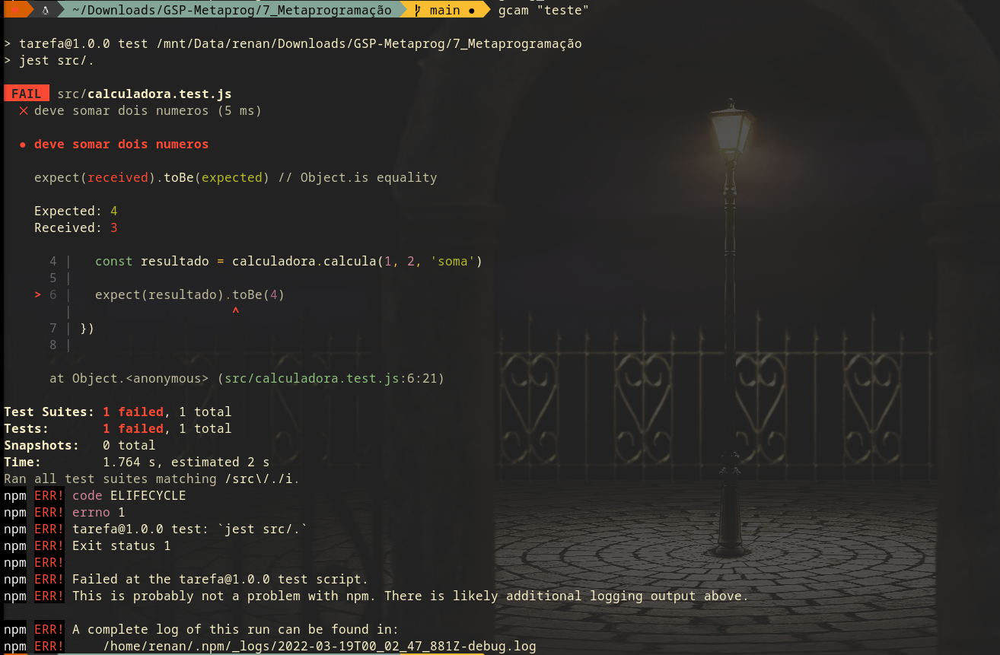

# Tarefa

## Pré-requisitos
- Instale o NodeJS e o Npm via linha de comando do Ubuntu (`sudo apt-get ...`) ou outro Linux de sua preferência
- Usuários de windows: **Não instalar a versão para windows**. Utilizem o WSL ou alternativas para um ambiente linux

## Entrega

O arquivo a ser entregue é um arquivo `.zip` contendo as respostas das perguntas que seguem **e** o código da pasta `tarefa` alterado conforme as instruções de cada seção. **Não é necessário incluir no arquivo `.zip` a pasta node_modules**.

## Seção 1 - Gerenciamento de dependências

O propósito desta seção é o aluno se familiarizar com dependências de projetos de software. As perguntas aqui contidas deverão ser respondidas em um arquivo `secao1.txt` no zip da entrega.

0. Tente rodar o comando `npm start`. Por que a execução do comando resulta em um erro?
  * **R**: Porque o projeto possui dependências, indicadas no arquivo `package.json`, e elas não estão instaladas.
1. Corrija o erro e execute novamente o `npm start`. O que você fez para corrigir?
  * **R**: Para que o projeto possa ser executado corretamente, é necessário instalar as dependências com o comando `npm install` ou `npm i`
2. Adicione a dependência `crypto-js` e modifique o programa para imprimir o resultado anterior encriptado com o algoritmo `SHA256`.

## Seção 2 - Integração contínua

Esta seção tem como objetivo apresentar alguns conceitos de integração contínua que foram vistos em aula. 

0. Copie o conteúdo da pasta `tarefa` para uma nova pasta e crie um repositório Git a partir dela (com o `git init`).
1. Crie um script executável `pre-commit` na pasta `.git/hooks/` (Há um arquivo `.git/hooks/pre-commit.sample` de exemplo).
2. Adicione o comando de teste do `npm` ao script, para que ele execute antes de cada commit.
3. Modifique o código do teste para que ele falhe (exemplo: `expect(resultado).toBe("isso_nem_eh_um_numero")`).
4. Tente fazer um commit. Ele deve falhar. Tire um *screenshot* do resultado.

5. Adicione o seu script no arquivo zip da tarefa.
  * **R**: Há um exemplo de script no repositório: `pre-commit`

## Seção 3 - Testes

0. Crie testes de unidade para as outras operações da `calculadora.js`.
1. Para a operação `pot`, faça um mock da biblioteca `math.js`, verificando se a operação correta foi chamada.

