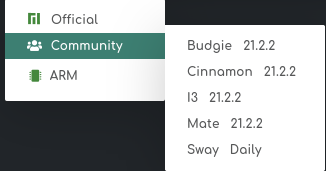

# 9 - Potpourri

Outras ferramentas e tópicos que não tivemos tempo de fazer uma aula própria.

## Window manager

### Desktop Environment (DE)

Uma DE permite que o usuário tenha uma experiência completa para a interface gráfica do usuário, ícones, barras de ferramentas, papéis de paredes e seu próprio gerenciador de janelas.

Pode ser comparado com o que é visto no Windows a barra de ferramentas, barra de pesquisa, gerenciador de tarefas etc....

Cada distribuição de Linux pode vir ou não com uma DE, dependo da distribuição ela te dá várias opções de DEs como pode ser visto na imagem abaixo:

<p align="center">
    
</p>

Essa imagem dá a opção para o usuário baixar a distribuição [Manjaro](https://manjaro.org/download/) com 3 opções oficiais de DEs.

Geralmente uma DE possui outros aplicativos que ajudam a compôr a interface gráfica do usuário.

Alguns DEs famosos são: `KDE`, `GNOME`, `XFCE`, `MATE`, etc...

O usuário tem a liberdade de adicionar programas de outros DEs por exemplo usando `KDE` eu posso usar programas do `GNOME` (provavelmente o tema dos programas não vai ser o mesmo já que são de DEs diferentes)

[Lista](https://wiki.archlinux.org/title/Desktop_environment_%28Portugu%C3%AAs%29#Lista_de_ambientes_de_desktop) de DEs disponíveis.

### Window Manager (WM)

Um WM ou gerenciador de janelas é o programa que vai controlar o posicionamento e a aparência das janelas em uma interface gráfica (GUI), por ser mais simples que uma DE, normalmente, um WM acaba utilizando menos memória RAM que um DE.

O WM pode ser usado dentro de uma DE ou usada de forma independente na imagem abaixo podemos ver dois WM (sway e i3):

<p align="center">
    
</p>

#### Tipos

Os WMs podem ser classificados em 3 tipos:

* [Stacking](https://wiki.archlinux.org/title/Window_manager_%28Portugu%C3%AAs%29#Gerenciadores_de_janela_de_empilhamento): É o tipo de organização mais comum para usuários de DEs, Windows e OS X, esse tipo de WM os programas ficam `flutuando` pela área de trabalho.

* [Tiling](https://wiki.archlinux.org/title/Window_manager_%28Portugu%C3%AAs%29#Gerenciadores_de_janela_de_tiling): Esse tipo de WM tem uma organização `automática`. Quando novas janelas são criadas elas automaticamentes são organizadas na área de trabalho de uma forma que as janelas não vão se sobrepor, a organização das janelas vai depender do WM usado ou da configuração do WM.

* [Dynamic](https://wiki.archlinux.org/title/Window_manager_%28Portugu%C3%AAs%29#Gerenciadores_de_janela_din%C3%A2micos): Esse tipo de WM abrange os dois tipos mostrados anteriormente o Stacking e o Tiling, O Dynamic consegue `transicionar` entre os modos de Stacking e Tiling, assim fica à escolha do usuário em qual modo ele quer que as janelas fiquem.

### WM x DE

Como visto antes uma DE é um WM com outras coisas que integram o desktop para que ele consiga ter bastantes funcionalidades.

Enquanto o WM é só um gerenciador de tarefas, ou seja ele pode ou não ter coisas como um sistema de menu, notificações, gerenciador de clipboard, gerenciador de internet, gerenciador de login, etc... outros softwares que vão ficar responsáveis por gerenciar essas coisas. Mas como o WM vem sem nada o usuário pode escolher o que ele quer instalar e vai gastar menos memória RAM no seu computador.

Para quem usa bastante o teclado vai ser uma boa opção já que quase nunca você vai precisar tirar suas mãos do teclado.

## Linters

### O que é um linter?

Linter é uma ferramenta para ajudar no desenvolvimento do seu código. O Linter analisa o código especificado procurando por problemas, podem ser eles problemas técnicos ou problemas de qualidade de código, sendo assim capazes de diagnosticar e arrumar problemas que podem passar despercebidos pelo programador.

O resultado será um código mais legível, consistente e mais fácil de manter, dessa forma também estarão contribuindo para ajudar programadores mais inexperientes à aprender sobre qualidade de código.

Além disso alguns Linters também conseguem manter o código mais seguro e perfomático, mas isso não é uma regra.

### Análise Estática

A análise estática é feito pelos linters para analisar o código em questão sem executar ele, checando por problemas, bugs, vazamento de memória e outros problemas.

### Erros de Sintaxe

Uma das coisas mais básicas que o Linter pode oferecer são verificar erros de sintaxe.

Erros de sintaxe são detectadas pelos compiladores em linguagens `compiladas` como c, c++, java, etc... Mas para linguagens `interpretadas` os erros apenas vão ser encontrados quando o código for executado, é aí que o Linter entra!

Um exemplo pode ser erros do `CSS` que vão apenas ser percebidos quando o site for acessado.

### Convenções de código

Convenções de código são de extrema importância quando se quer criar um código para ser mantido ou um cógido que vai ser usado por muitas pessoas.

Ter uma convenção de código único facilita a leitura de um código, ao invés de ter estilos de código de vários desenvolvedores diferentes que iria dificultar a legibilidade do código.

### Problemas em potencial

Um exemplo de problemas em potencial ou `code smells` são, por exemplo, funções grandes.

Dependendo de pessoa para pessoa funções grandes podem ser consideradas potenciais problemas, então é possível configurar o Linter para detectar funções que são maiores que um certo número de linhas e então o desenvolvedor pode verificar esses potenciais problemas e arrumar eles.

### Performace

A performace, já vista em aulas passadas especificamente em perfilamento, é de suma importância para a o desenvolvimento de um aplicativo.

Muitos linters também incluem verificação de performace, eles podem adicionar diferentes tipos de performace e para novos programadores pode ajudar bastante no desenvolvimento e no aprendizado.

### Segurança

A segurança é um dos maiores problemas no desenvolvimento de um código ou o maior problema que os devem se preocupar.

Não se aplica para todos os linters, mas existem linters específicos que podem oferecer verificações de segurança durante o desenvolvimento de um aplicativo.

### Exemplos

Para quem quiser dar uma olhada nos linters existentes e quais linguagens de programação eles conseguem suportar existe um [repositorio](https://megalinter.github.io/5.7.0/all_linters/) com uma variedade de linters especificando sua licença, linguagem, versão, repositório, etc... Existem outros repositórios com indicações de linters como [esse](https://github.com/caramelomartins/awesome-linters).

Vai depender do programador pesquisar e escolher qual linter é melhor para seu uso no dia-a-dia.

## Suite de redes Linux

Antes de falar sobre a suite de ferramentas para redes em Linux, uma breve aula sobre redes:

A internet é a rede mais famosa que conhecemos, mas é somente uma de varias redes que regem a conexão entre computadores.

Cada rede tem seus próprios endereços IPs, e pode ou não estar conectada a internet ou a outra rede. Esses endereços são o que identificam uma máquina ou um nó na rede. Cada máquina em uma rede tem pelo menos um endereço, e cada endereço é único dentro dessa rede.

Por que eu digo "pelo menos"? Porque uma mesma máquina pode ter mais de um endereço vinculado a ela, pois o que retém controle desse endereço não é a máquina ou o sistema operacional, mas sim os dispositivos de rede. Se você tiver um adaptador *WiFi* e um cabo conectados ao seu computador ao mesmo tempo, cada uma dessas entradas (ou *NICs* de *Network Interface Cards*) terão seu próprio endereço de IP distinto.

Uma máquina também pode estar conectada a duas redes ao mesmo tempo. Essa máquina é chamada de *gateway*, pois vira o portão, ou *gateway*, entre uma rede e outra (mas pode ter somente um *gateway* por rede, e esse normalmente é o seu roteador, que conecta sua rede local à internet). Se uma máquina em uma dessas redes quiser se conectar a uma máquina da outra rede, a conexão entre essas duas máquinas vai passar por essa máquina configurada como *gateway*.

Existem vários grupos de endereços que são reservados. Alguns desses grupos são reservados para redes locais, detalhados no RFC 1918. Essas são:

- `10.0.0.0/8`: do endereço `10.0.0.0` a `10.255.255.255`
- `172.16.0.0/12`: do endereço `172.16.0.0` a `172.31.255.255`
- `192.168.0.0/16`: do endereço `192.168.0.0` a `192.168.255.255`

Esses endereços (em notação *CIDR*) não podem aparecer na internet. Quem controla a distribuição de endereços da internet é a IANA (*Internet Assigned Numbers Authority*). Ela que fala quem esta responsável por quais grupos de redes.

Em uma máquina, podem ter vários programas que utilizam a internet ao mesmo tempo. O sistema operacional faz o controle de qual programa é responsável por qual conexão através da associação de portas a programas. Os programas podem pedir por uma porta ao sistema operacional, e quando alguém quiser usar tal programa, ele vai ter que especificar a porta (além do endereço IP) em cada conexão para acessar aquele programa ou serviço rodando naquela máquina.

Com esses conhecimentos a gente pode começar a usar as ferramentas de redes.

### `ssh` e `scp`

#### SSH

SSH (*Secure SHell*) é um programa que permite acesso remoto a uma shell em uma outra máquina.

Para se conectar a um computador remoto, ele precisa estar rodando um servidor SSH e você precisa saber as credenciais de um usuário do sistema. Exemplo:

```bash
ssh user@10.0.0.225
```

Se o servidor não estiver rodando na sua porta padrão, você pode definir a porta através da opção `-p`. Outras opções mais interessantes podem ser descobertas no `man` do ssh como o `-L` e o `-D`.

#### SCP

SCP (*Ssh CoPy*) utiliza o protocolo SSH para copiar arquivos entre dois computadores.

O uso é bem parecido com o SSH: você precisa de uma máquina rodando um servidor. Os parâmetros lembram bastante o próprio comando `cp` do Linux:

```bash
scp <origem> <destino>
```

Tanto a origem quanto o destino podem ser uma pasta em um computador remoto (`usuario@endereco:pasta/a/partir/da/raiz`, ex.: `user@10.0.0.225:Downloads/arquivo.pdf`) ou um arquivo local (`~/caminho/para/o/arquivo`, ex.: `/etc/passwd`).

### `ss`

Ss (*Socket Statistics*) lista todos os processos atualmente vinculados a uma porta.

Algumas opções interessantes que são interessantes de usar com o SS: `-t` para listar somente conexões TCP; `-l` para listar somente as portas ouvindo por conexões (servidores); `-p` para listar o processo responsável por aquela porta e; `-n` para não tentar inferir o nome do serviço a partir do nome da porta.

O comando fica assim:

```bash
ss -tnlp
```

### `python3 -m http.server`

Esse comando python roda o módulo `http.server` como um programa, e cria um pequeno servidor HTTP pelo qual você consegue acessar e baixar arquivos que estão na sua máquina local.

Basta entrar em uma pasta e rodar:

```bash
python3 -m http.server
```

Que um servidor HTTP estará rodando na sua máquina local na porta `8000`. Também e possível escolher a porta em que o servidor vai rodar passando uma porta como argumento. O próximo comando roda um servidor na porta `8080`:

```bash
python3 -m http.server 8080
```

### `ngrok`

Ngrok é uma ferramenta que disponibiliza um endereço na internet para outras pessoas em outras redes locais conseguir acessar seus serviços, que estão rodando dentro da sua rede local.

Você pode expor uma porta, e ela pode estar rodando um servidor HTTP ou um serviço TCP qualquer (que não um servidor HTTP).

Para expor um servidor HTTP, rode:

```bash
ngrok http 8000
```

E para expor um servico TCP qualquer, rode:

```bash
ngrok tcp 42000
```

