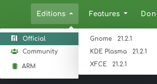

# Desktop Environment (DE)

Uma DE permite que o usuário tenha uma experiência completa para a interface gráfica do usuário, ícones, barras de ferramentas, papéis de paredes e seu próprio gerenciador de janelas.

Pode ser comparado com o que é visto no Windows a barra de ferramentas, barra de pesquisa, gerenciador de tarefas etc....

Cada distribuição de Linux pode vir ou não com uma DE, dependo da distribuição ela te dá várias opções de DEs como pode ser visto na imagem abaixo:

    

Essa imagem dá a opção para o usuário baixar a distribuição [Manjaro](https://manjaro.org/download/) com 3 opções oficiais de DEs.

Geralmente uma DE possui outros aplicativos que ajudam a compôr a interface gráfica do usuário.

Alguns DEs famosos são: `KDE`, `GNOME`, `XFCE`, `MATE`, etc...

O usuário tem a liberdade de adicionar programas de outros DEs por exemplo usando `KDE` eu posso usar programas do `GNOME` (provavelmente o tema dos programas não vai ser o mesmo já que são de DEs diferentes)

[Lista](https://wiki.archlinux.org/title/Desktop_environment_%28Portugu%C3%AAs%29#Lista_de_ambientes_de_desktop) de DEs disponíveis.

# Window Manager (WM)

Um WM ou gerenciador de janelas é o programa que vai controlar o posicionamento e a aparência das janelas em uma interface gráfica (GUI).

O WM pode ser usado dentro de uma DE ou usada de forma independente na imagem abaixo podemos ver dois WM (sway e i3):

    

## Tipos

Os WMs podem ser classificados em 3 tipos:

* [Stacking](https://wiki.archlinux.org/title/Window_manager_%28Portugu%C3%AAs%29#Gerenciadores_de_janela_de_empilhamento)
* [Tiling](https://wiki.archlinux.org/title/Window_manager_%28Portugu%C3%AAs%29#Gerenciadores_de_janela_de_tiling)
* [Dynamic](https://wiki.archlinux.org/title/Window_manager_%28Portugu%C3%AAs%29#Gerenciadores_de_janela_din%C3%A2micos)

# Desktop Environment X Window Manager
